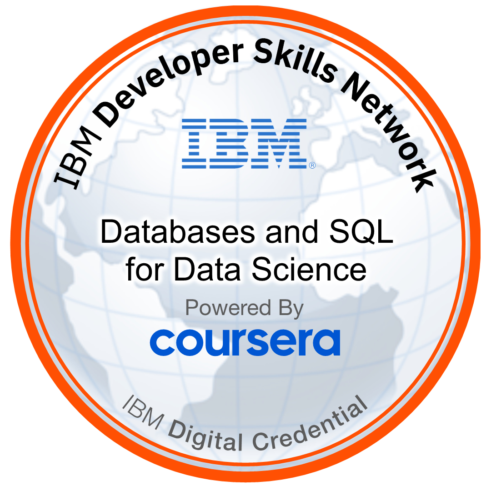

## Hi there 👋

Hello, on this profile, you can find information on two different areas. First, projects I have worked on in my professional career, particularly in the realm of ✨ **data science** and **data analysis**✨. 

Second, projects I have undertaken as part of my master's studies and thesis, which include ✨ **molecular dynamics simulations**, **protein dynamics**, and **drug discovery**✨. 
<

### Languages and Libraries

    
    Pyomo

### Tools & Technologies I Use

## MyBadges 

To see all the other badges are [here](https://www.credly.com/users/haci-aslan-onur-iscil/badges)

