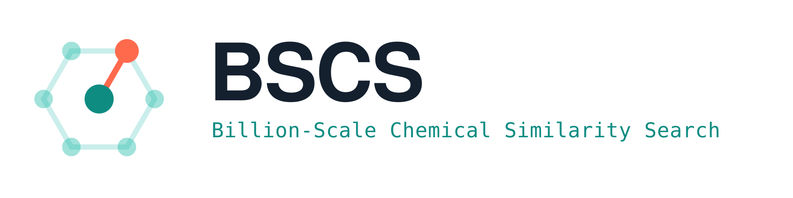
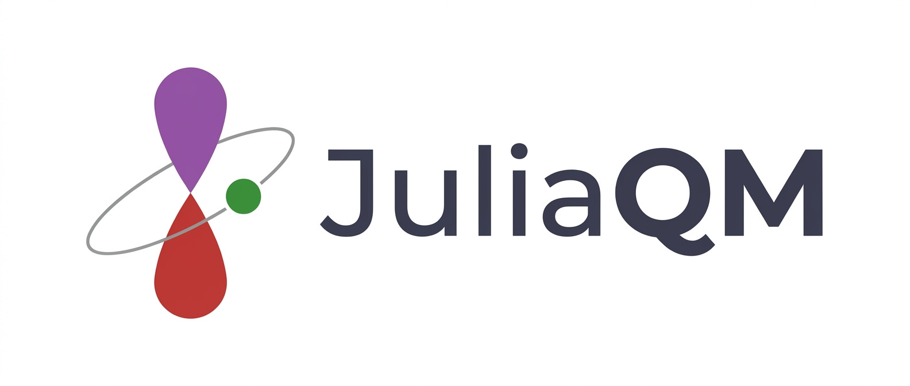
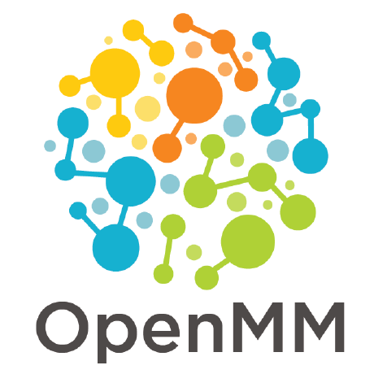
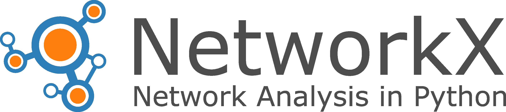
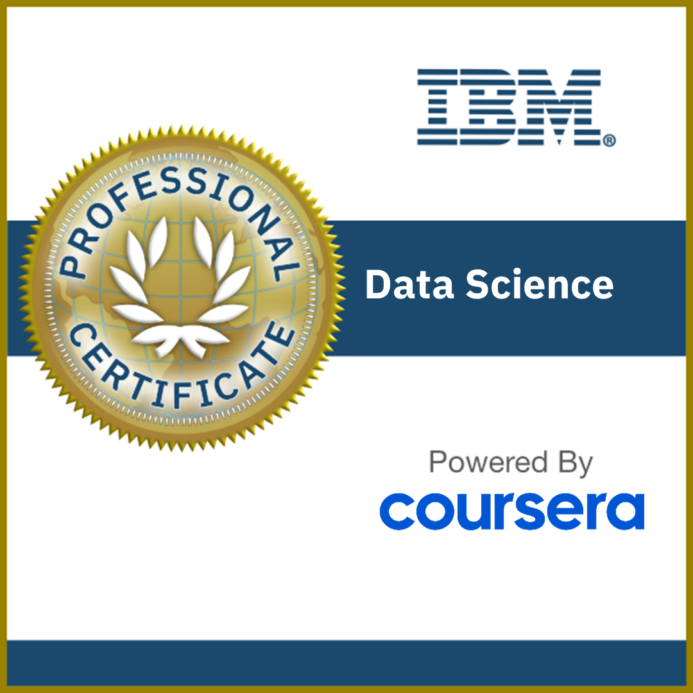
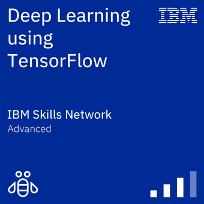
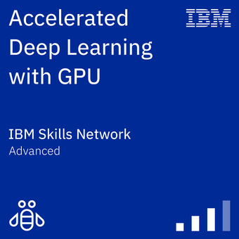
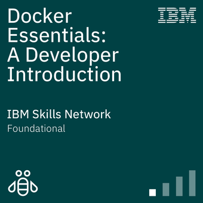
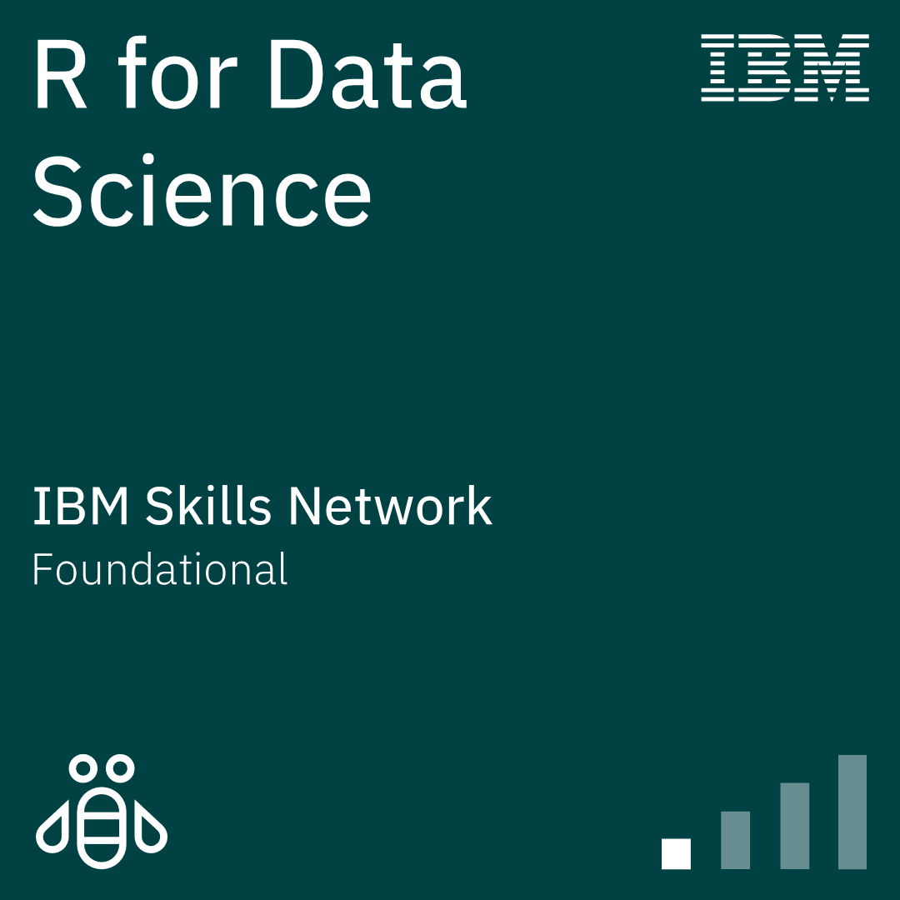
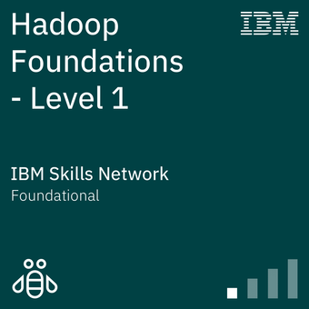

## Hi there 👋

Hello, on this profile, you can find information on two different areas. First, projects I have worked on in my professional career, particularly in the realm of ✨ **cheminformatics** & **Bioinformatics ** & **data science** & **data analysis**✨. 

Second, projects I have undertaken as part of my master's studies and thesis, which include ✨ **molecular dynamics simulations**, **protein dynamics**, and **drug discovery**✨. 
<

##  Featured projects 

## Featured Projects

<table>
  <tr>
    <td width="50%" align="center" valign="top">
      
        
      <h3>
        <a href="https://github.com/onuryus/BSCS">
          BSCS
        </a>
      </h3>
      <strong>Billion-Scale Chemical Similarity Search</strong>
        
      A high-performance chemical similarity search engine designed for
      million- to billion-scale molecular libraries using molecular fingerprints,
      FAISS indexing, and exact similarity reranking.
        
      <strong>C++ · RDKit · FAISS · Cheminformatics</strong>
        
      
    </td>
    <td width="50%" align="center" valign="top">
      
        
      <h3>
        <a href="https://github.com/onuryus/JuliaQM">
          JuliaQM
        </a>
      </h3>
      <strong>Quantum Chemistry Engine in Pure Julia</strong>
        
      A quantum chemistry engine written from scratch in pure Julia, supporting
      electronic structure calculations, geometry optimization, molecular
      properties, and vibrational analysis.
        
      <strong>Julia · Quantum Chemistry · Electronic Structure</strong>
        
      
    </td>
  </tr>

  <tr>
    <td width="50%" align="center" valign="top">
      
        
      <h3>
        <a href="https://github.com/onuryus/poseqm">
          PoseQM
        </a>
      </h3>
      <strong>Quantum-Mechanical Binding Pose Evaluation</strong>
        
      A computational chemistry toolkit for evaluating, refining, and ranking
      molecular binding poses using quantum-mechanical calculations and
      structure-based analysis.
        
      <strong>Quantum Chemistry · Docking · Pose Refinement</strong>
        
      
    </td>
    <td width="50%" align="center" valign="middle">
         
      <h2>🧪</h2>
      <h3>Antioxidant Screening Engine</h3>
      <strong>Coming Soon</strong>
        
      A new computational platform for large-scale antioxidant screening,
      thermodynamic descriptor analysis, and mechanism-based molecular
      evaluation is currently under development.
        
      <strong>Quantum Chemistry · Molecular Screening · Machine Learning</strong>
        
      
    </td>
  </tr>
</table>

### MD (Molecular Dynamics) & QM (Quantum Mechanics) Tools

    
    
    
    
     

### Languages and Libraries

    
    

### Tools & Technologies I Use

## MyBadges 

To see all the other badges are [here](https://www.credly.com/users/haci-aslan-onur-iscil/badges)

<table> <tr> <td align="center" width="33%">    <strong>Data Science</strong>   165 Hours · 12 Courses </td> <td align="center" width="33%">    <strong>Deep Learning Using TensorFlow</strong> </td> <td align="center" width="33%">    <strong>Accelerated Deep Learning with GPU</strong> </td> </tr> <tr> <td align="center" width="33%">    <strong>Docker Essentials</strong> </td> <td align="center" width="33%">    <strong>R for Data Science</strong> </td> <td align="center" width="33%">    <strong>Hadoop Foundations</strong> </td> </tr> </table>
